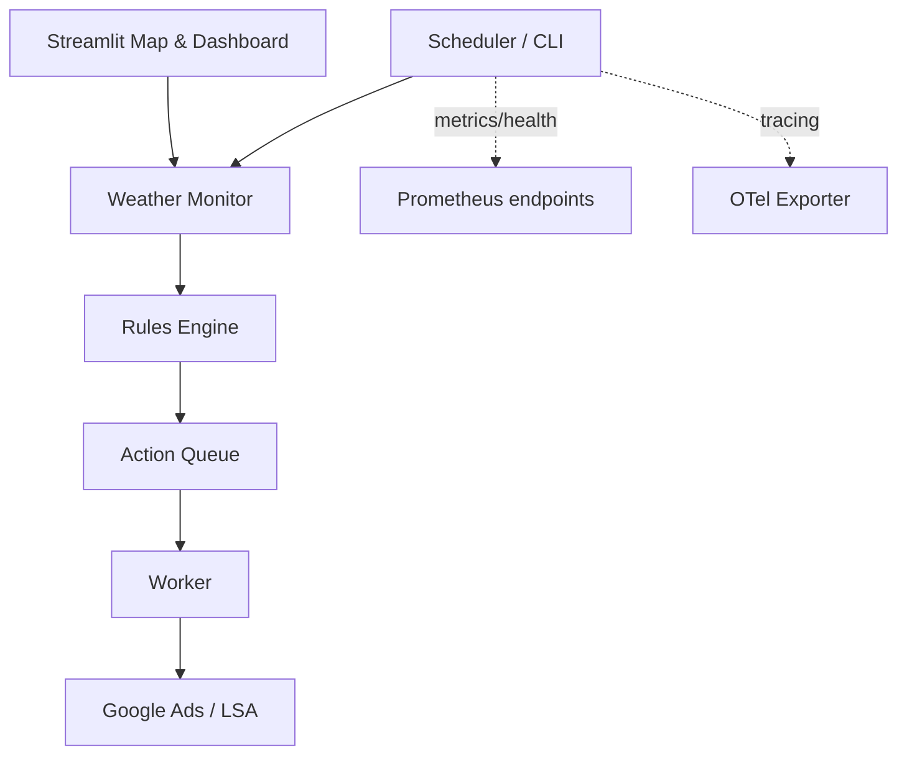

# Architecture Overview

This document provides a concise map of the system, data flow, and invariants.

## Modules and flow

## Key invariants

- Mutations guarded by DRY_RUN, VALIDATE_ONLY, REQUIRED_CAMPAIGN_LABELS, and LSA_ONLY (when set).
- Quiet hours and kill switches prevent changes during restricted windows.
- Each action is idempotent and audited to logs/JSONL with timestamps.

## Settings

- Centralized via `src/config/settings.py` with Pydantic Settings.
- Environment variables can override defaults; `.env.example` provides guidance.

## Persistence

- SQLite database in `data/app.db` for queue and audit. Schema helpers live in `src/db.py`.

## UI

- Streamlit multipage app (`ui/`) with Folium map, overlays, archive timeline, and status/health pips.
